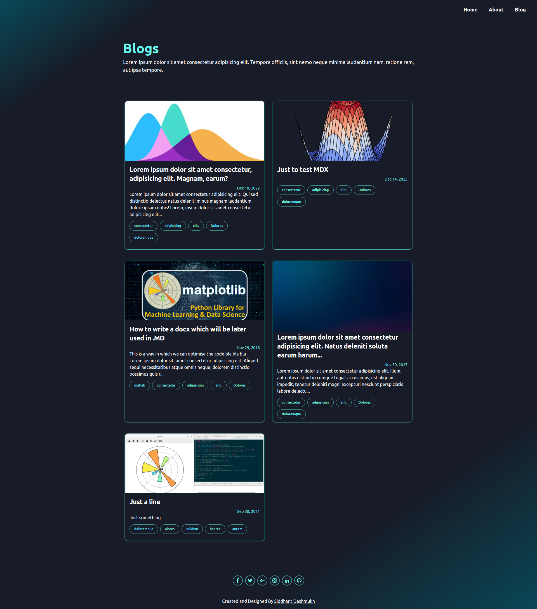
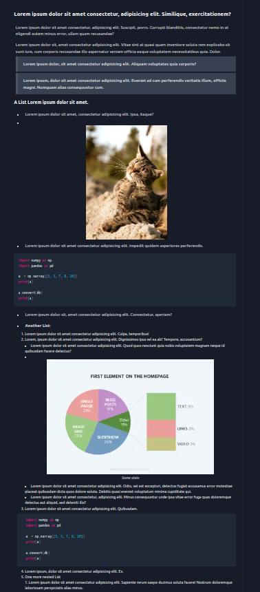
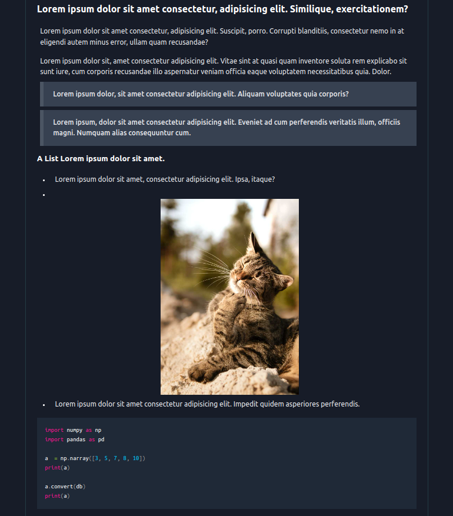

# Gatsby blog

> Scan a folder having markdown files (.MD or .MDX) and convert them into static html pages.

> A SSG application made with Gatsby, tailwindcss, [gatsby-plugin-mdx]('https://www.gatsbyjs.com/plugins/gatsby-plugin-mdx/?=gatsby-plugin-mdx), [gatsby-remark-prismjs]('https://www.gatsbyjs.com/plugins/gatsby-remark-prismjs/?=prism') or [prismjs]('https://prismjs.com/)

## Images

* Home Page Full
* 

* Blog Page Header Frontmatter section
* 

* Blog Page Features: Quotes, Image, Heading2/3, Code, List
* 

* Blog Page Features: Quotes, Image, Heading2/3, Code, List
* 


## Installation:

**You have to build the pages so locally** so please follow the steps.

1. First Clone the application.
2. Node.js above v18.15.0 should be installed.
3. Install the gatsby-cli globally 
    ```shell 
      npm install --global yarn
      npm install -g gatsby-cli
    ```
4. Now check if installed correctly
    ```shell
      gatsby --version
    ```
5. Go in the root directory where the Git repo is clone and install all the dependencies
   ```shell
      yarn install 
   ```
6. Now to check the website in dev mode run
   ```
      gatsby develop --verbose
   ```
7. Wait till this process 
   1. 
8. And check the website first if it is working correctly on http://localhost:8000/
9. If takes too long or error occured close the terminal `Ctrl+C` and try again few times.
   1. This is a heavy process so might take time depnding the number of files and images.
10. If yes then build the application
   ```
      gatsby build
   ```
11. A new **`public`** folder will be created.
   1.  The whole website is in public folder to still check it again 
   2.  **open the `public` folder in vs code**
   3.  And run Live Server ( the root folder should be `/public` )
   4.  Now check it again and if everything seems fine the deploy it!
   5.  This are all static files generated inside the /public folder you can directly deploy them


## What is SSG? or how the application works

After running the build command gatsby scan the `src/pages` folder and follow the file structure as the url structure

1. e.g if the files was `pages/meow/about.tsx` it will appear on url `{main-url}/meow/about.html`
2. Also the special cases are `404.tsx` it will appear if someone goes on wrong url which has not been declared.
3. And `pages/index.tsx` is the home page.
4. And `src/pages/{mdx.frontmatter__slug}.tsx` will scan all the .mdx and .md files from **CMS**.
5. CMS means content management system. Inside `gatsby-config.ts` checkout `gatsby-source-filesystem` inside `plugin`. This will add our `blogs/` folder and its content in the CMS and hence .md files inside the blogs/ folder will be converted into html pages.
